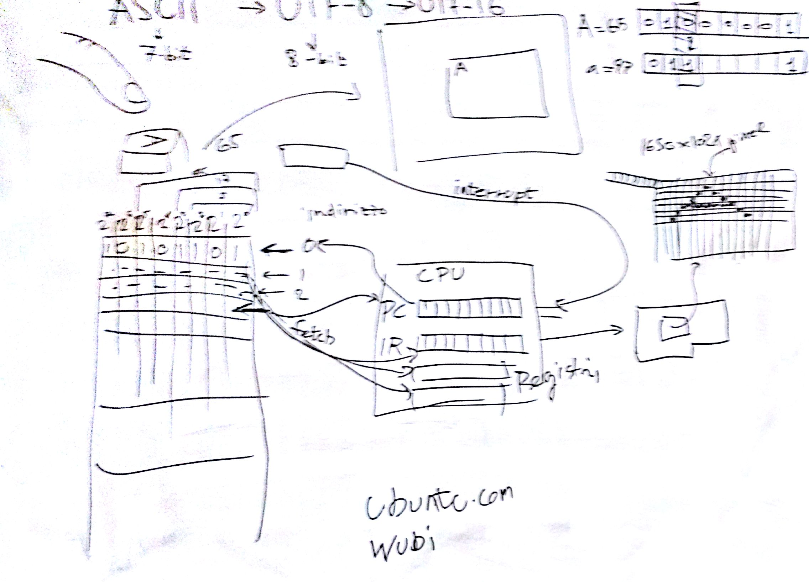

# Lezione di lunedì 25 gennaio 2016 (Informatica)

## Argomenti

* Elementi di base dei computers
  * numerazione binaria
  * memoria: contenuti, indirizzamento
  * CPU
  * sequenza di boot
  * display (bn, colore, profondità del colore in bits)
