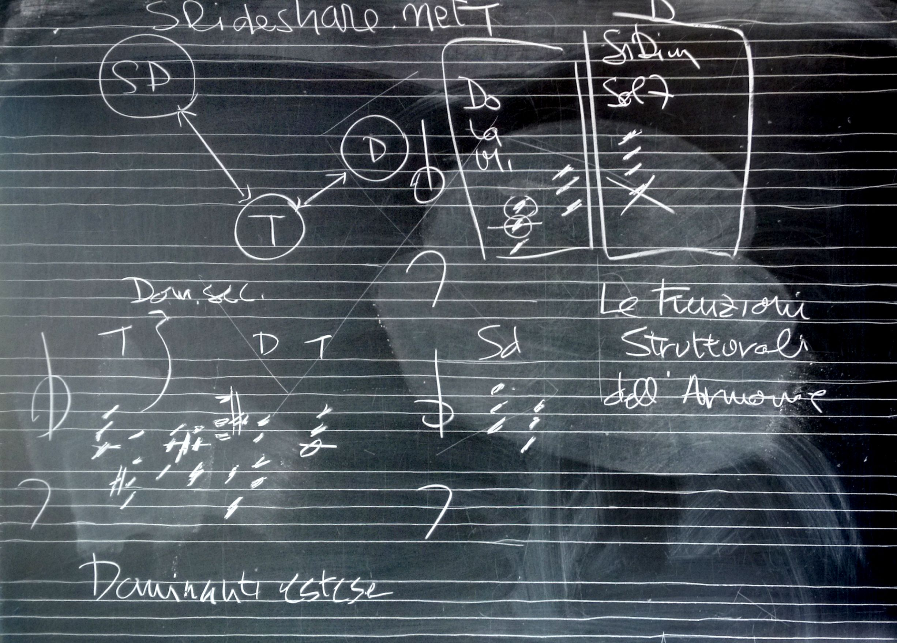

# Lezione del 27 gennaio 2016 (*TCMC*)

## Argomenti

* revisione ascolto *analitico* di:
  * Bela Bartok               *Sonata per 2 pianoforti e percussione*
  * Alban Berg                *Drei Orchesterstűcke op6*
  * Luciano Berio             *Sinfonia*
* slides da p.11

## Compiti per casa

* ascolto *analitico* di:
  * Pierre Boulez             *Le Marteau sans Maître*
  * Pierre Boulez             *Rituel (in memoriam Bruno Maderna)*
  * Anton Bruckner            *9a Sinfonia*
