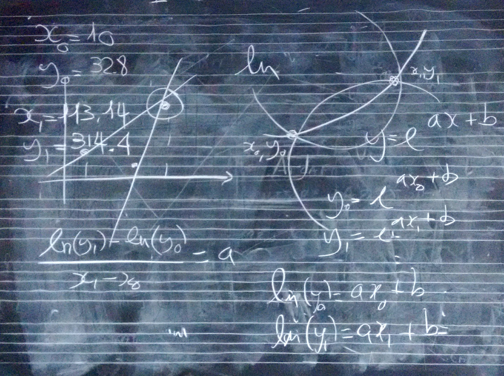
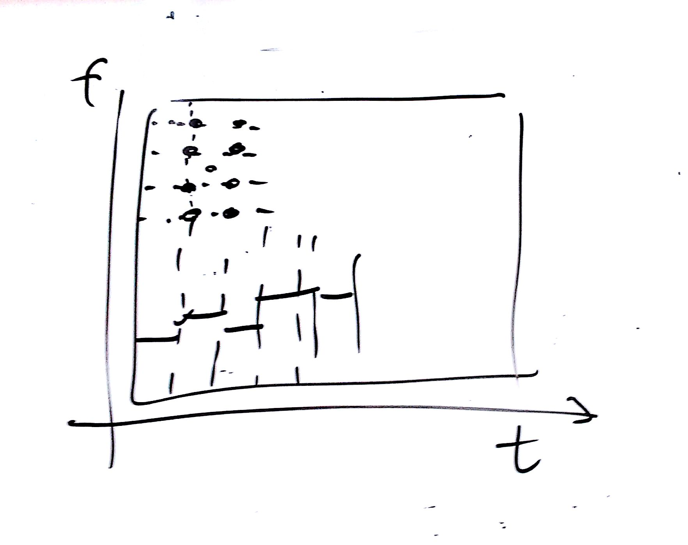

# Lezione del 09 febbraio 2016 (*matematica*)

## Argomenti

* correzione del compito per casa
  * realizzare una funzione lineare "in discesa"
* funzioni esponenziali (due punti)

## Compiti per casa

* correzione funzione logaritmiche
