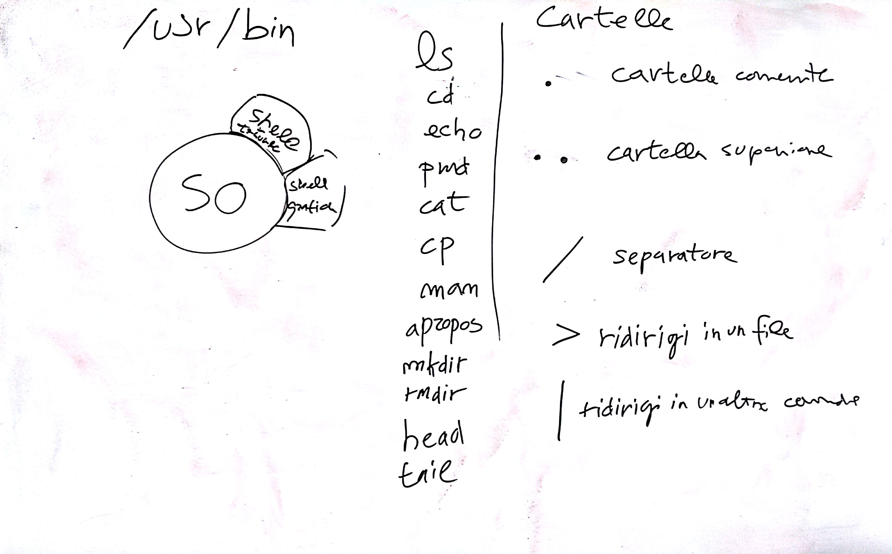

# Lezione di lunedì 15 febbraio 2016 (*Informatica*)

## Argomenti

* Elementi di base dei computers
  * le shell testuali
    * organizzazione di base: `focus`, `idle state`
    * parsing dei comandi: separatore (spazio), comando, argomenti
    * comandi di base:
      * `ls`
      * `cd`
      * `echo`
      * `pwd`
      * `cat`
      * `cp`
      * `man`
      * `apropos`
      * `mkdir`
      * `rmdir`
      * `head`
      * `tail`
      * `ln`
    * differenze tra copia (`cp`), *hard link* (`ln`) e *soft link* (`ln -s`)
