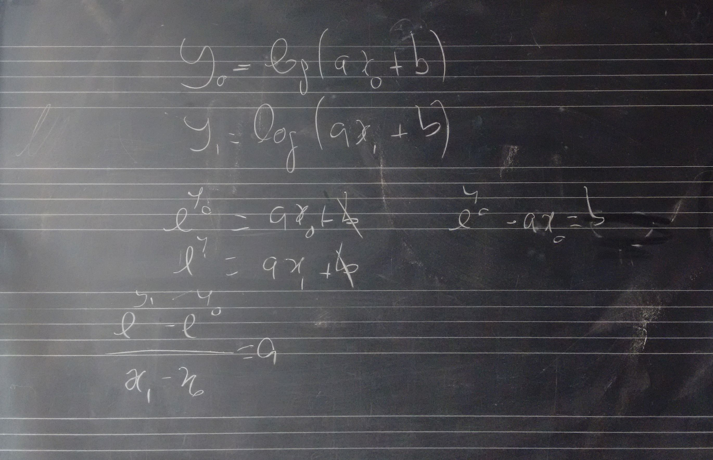

# Lezione del 16 febbraio 2016 (*matematica*)

## Argomenti

* correzione del compito per casa
  * realizzare una funzione esponenziale
* funzioni logaritmiche (due punti)

## Compiti per casa

* realizzare tre funzioni (lin, exp, log) con due punti dati in classe
