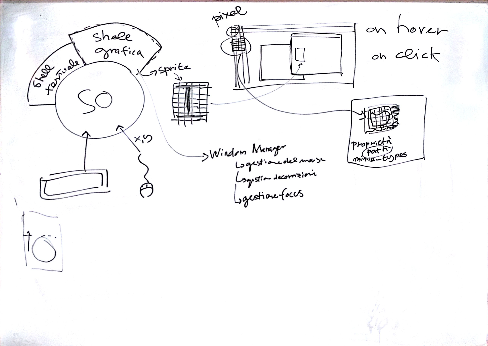
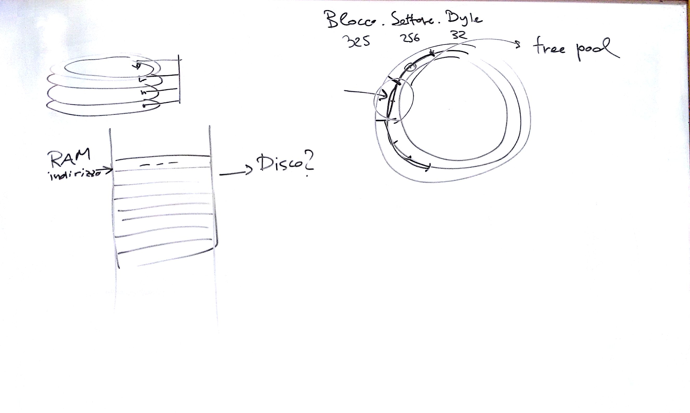

# Lezione di lunedì 07 marzo 2016 (*Informatica*)

## Argomenti

* Elementi di base dei computers
  * *software layers*:
    * la grafica
    * shell grafiche
  * problemi della grafica (definizione, profondità del colore, ecc.)
  * introduzione alla struttura di un `file system`
    * indirizzamento della RAM vs. indirizzamento sul disco
    * `blocks` vs. `characters`
