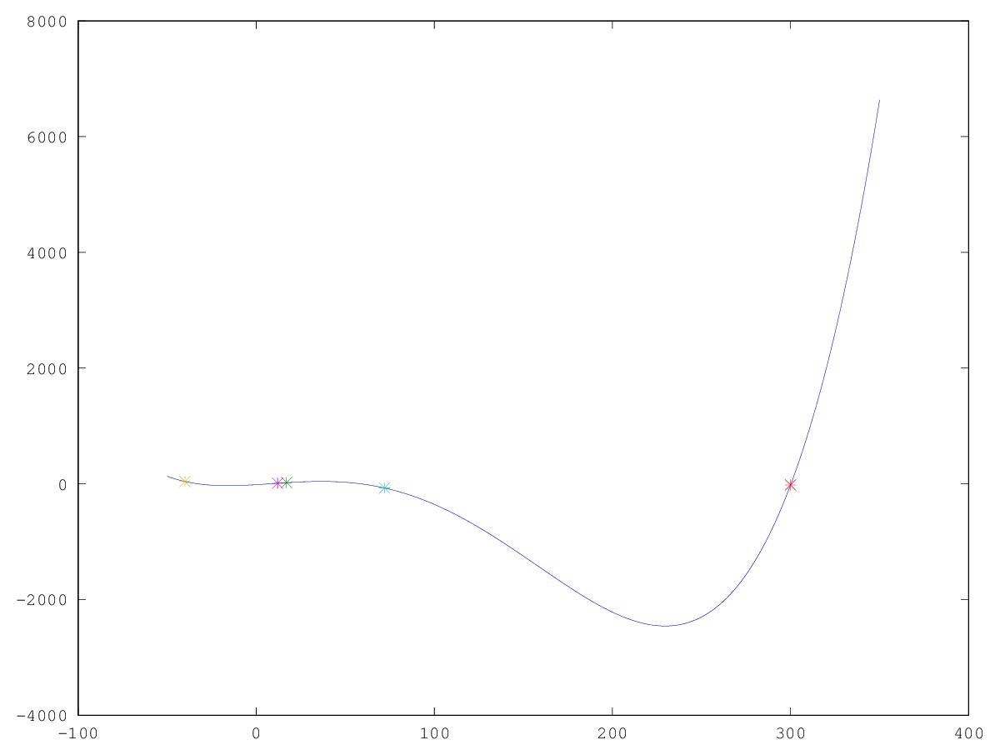

# Lezione del 8 marzo 2016 (*matematica*)


## Argomenti

* correzione del compito per casa
  * realizzare tre funzioni (lin, exp, log) con due punti dati in classe
* funzioni con più punti (polinomi, radici, ecc.)
* realizzazione di `poly4.m`:

```octave
  x0=17 ; x1=300 ; x2=72,3 ; x3=12 ; x4=-40 ;
  y0=20 ; y1=-20 ; y2=-72,3 ; y3=10 ; y4=40 ; 
  xconst=[x0 x1 x2 x3 x4];
  yconst=[y0 y1 y2 y3 y4];
  p = polyfit (xconst, yconst, 4);
  x=[-50 : 0.1 : 350];
  y=(p(1)*(x.^(4)))+(p(2)*(x.^(3)))+(p(3)*(x.^(2)))+(p(4)*(x.^(1)))+p(5);
  plot(x, y, x0, y0, "*", x1, y1, "*", x2, y2, "*", x3, y3, "*", x4, y4, "*")
```




## Compiti per casa

* Usare la funzione fatta in classe modificandone il lato destro in modo che cresca, e controllarne il lobo inferiore
