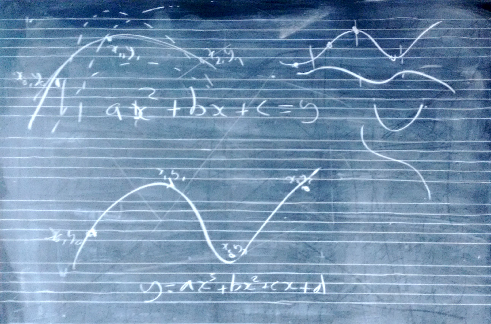
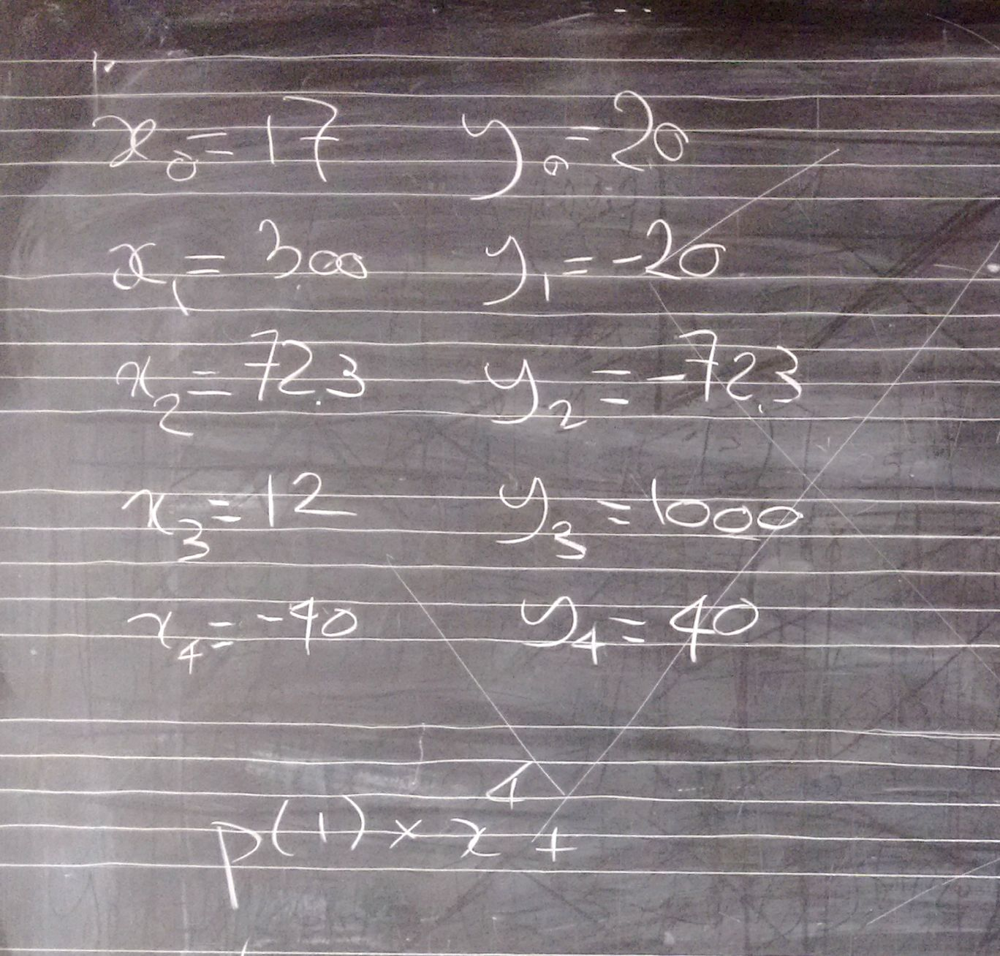

# Lezione del 8 marzo 2016 (*matematica*)

## Argomenti

* correzione del compito per casa
  * realizzare tre funzioni (lin, exp, log) con due punti dati in classe
* funzioni con più punti (polinomi, radici, ecc.)

## Compiti per casa

* Usare la funzione fatta in classe modificandone il lato destro in modo che cresca, e controllarne il lobo inferiore
