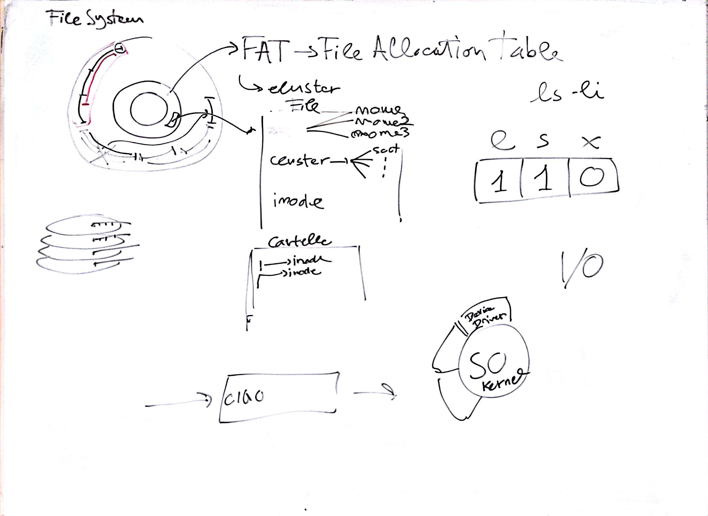

# Lezione di lunedì 21 marzo 2016 (*Informatica*)

## Argomenti

* Elementi di base dei computers
  * conclusione della struttura di un `file system`
    * `FAT` (File Allocation Table)
    * nomi dei files, permessi, ecc.
  * device drivers
  * I/O
    * file come metafora, 
