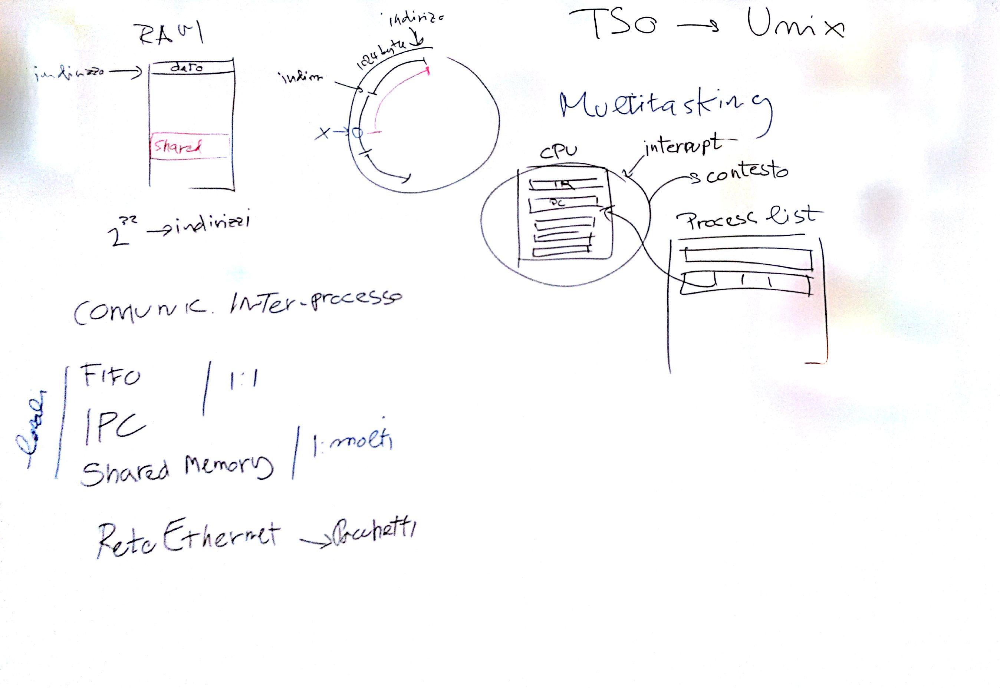
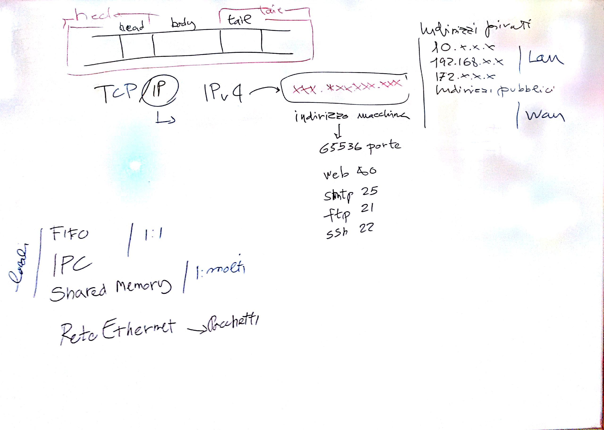
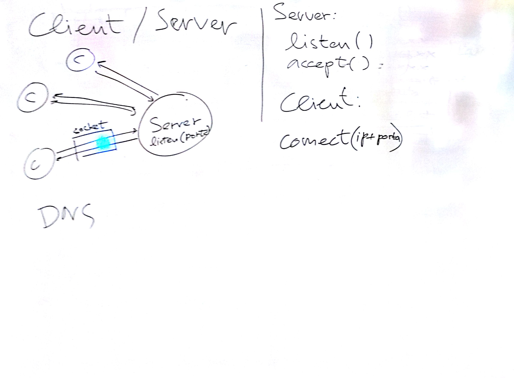

# Lezione di lunedì 4 aprile 2016 (*Informatica*)

## Argomenti

* Elementi di base dei computers
  * reti:
    * architetture:
      * IPC
      * client/server
      * protocolli
    * indirizzamento dei servizi
      * ip
      * porte
        * porte riservate
        * porte assegnabili
    * servizi comuni
      * DNS
      * web
        * protocollo HTTP
        * formato HTML
      * ftp
    * servizi orientati alla musica
      * OSC
