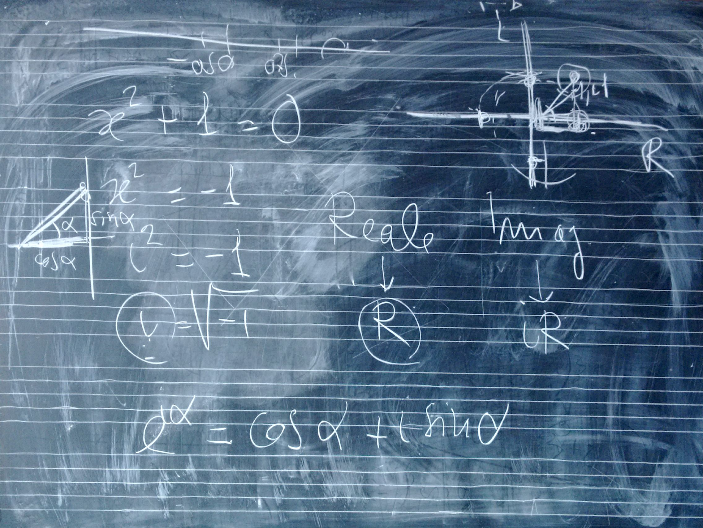

# Lezione del 5 aprile 2016 (*matematica*)

## Argomenti

* correzione del compito per casa
  * Usare la funzione fatta in classe modificandone il lato destro in modo che cresca, e controllarne il lobo inferiore
* Introduzione ai numeri complessi
  * funzionamento
  * funzioni complesse
  * elevazione di `i`
  * formula di Eulero
